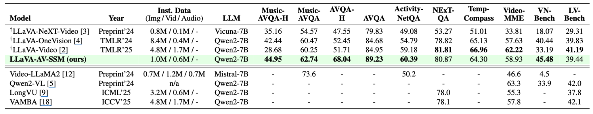

<div align="center">

# Official repository for “Does Audio Matter for Modern Video-LLMs and Their Benchmarks?"

[](https://arxiv.org/abs/2509.17901)
[](#updates)



</div>

## TL;DR
- Many “video understanding” benchmarks are solvable from a single frame; audio is often ignored without penalty.
- We augment a LLaVA-style baseline with a speech/audio encoder and use a lightweight Mamba-based state-space compressor to prevent audio-token explosion.
- Audio brings small gains on common suites but is decisive on curated, audio-sensitive subsets (AVQA-Hard, Music-AVQA-Hard).

## Updates
- 2025-09-22: Preprint released on arXiv.

## Introduction
Most “video understanding” evaluations ignore audio, yet real videos are inherently audio-visual. We ask how much audio actually matters for modern Video-LLMs and the benchmarks that certify them. Starting from a LLaVA-style backbone, we attach a speech/audio encoder and address audio token explosion with a lightweight Mamba-based state-space compressor. Our audit shows that many standard items are solvable from a single frame, so audio rarely helps on mainstream suites; however, after removing such shortcuts, audio becomes decisive. To enable faithful evaluation, we curate AVQA-Hard and Music-AVQA-Hard and outline a simple recipe for audio-sensitive assessment.

For more detailed information, please refer to our paper linked below:<br>
> [**Does Audio Matter for Modern Video-LLMs and Their Benchmarks?**](https://arxiv.org/abs/2509.17901).<br>
> [Geewook Kim](https://geewook.kim) and [Minjoon Seo](https://scholar.google.com/citations?user=zYze5fIAAAAJ). Preprint, under review.

## Citation
If you find this work useful, please cite:
```bibtex
@misc{kim2025doesaudiomattermodern,
  title         = {Does Audio Matter for Modern Video-LLMs and Their Benchmarks?},
  author        = {Geewook Kim and Minjoon Seo},
  year          = {2025},
  eprint        = {2509.17901},
  archivePrefix = {arXiv},
  primaryClass  = {cs.CV},
  url           = {https://arxiv.org/abs/2509.17901}
}
